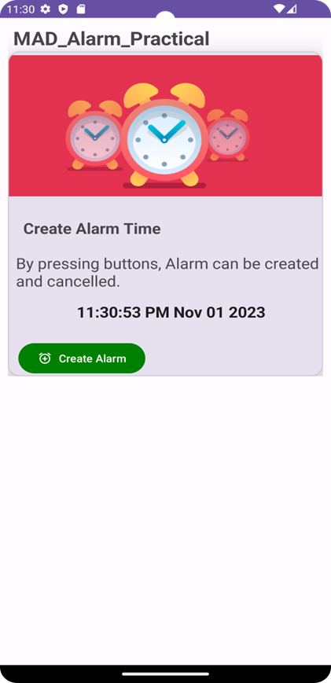
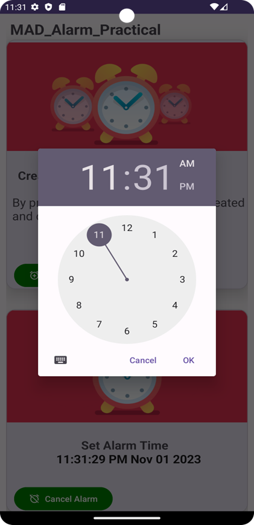
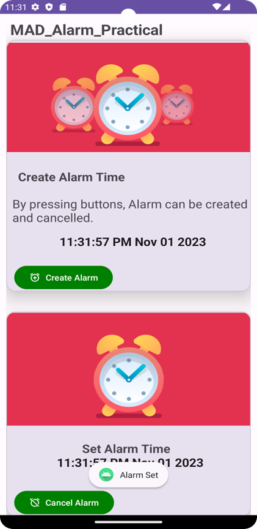

# P8_21012011046
# Alarm Application

- Submitted By: MAKWANA SWASTIK PRAVIN

- Enrollment number: 21012011046

## AIM
Create an Alarm application by using service & BroadcastReceiver by following the instructions below.

## Instructions

1. **Create MainActivity**: Implement the main activity according to the provided UI design.

2. **Create AlarmBroadcastReceiver class**: Implement a BroadcastReceiver for handling alarm events.

3. **Create AlarmService Class**: Implement a service to play the alarm sound.

4. Add `android.permission.SCHEDULE_EXACT_ALARM` permission in the Manifest file.

## Screenshots
Here are the screenshots of the application:





## Code

### MainActivity
The MainActivity allows you to create and cancel alarms. It provides a TimePickerDialog to set the alarm time. When an alarm is created, it displays the alarm time and allows you to cancel it.
### Activity_main.xml
```xml
<?xml version="1.0" encoding="utf-8"?>
<androidx.constraintlayout.widget.ConstraintLayout xmlns:android="http://schemas.android.com/apk/res/android"
    xmlns:app="http://schemas.android.com/apk/res-auto"
    xmlns:tools="http://schemas.android.com/tools"
    android:layout_width="match_parent"
    android:layout_height="match_parent"
    tools:context=".MainActivity">

    <androidx.core.widget.NestedScrollView
        android:layout_width="match_parent"
        android:layout_height="match_parent"
        app:layout_constraintStart_toStartOf="parent"
        >

        <androidx.constraintlayout.widget.ConstraintLayout
            android:layout_width="match_parent"
            android:layout_height="wrap_content"
            android:padding="10dp">

            <TextView
                android:id="@+id/textView"
                android:layout_width="wrap_content"
                android:layout_height="wrap_content"
                android:text="MAD_Alarm_Practical"
                android:textSize="25dp"
                android:textStyle="bold"
                android:layout_marginBottom="10dp"
                app:layout_constraintEnd_toEndOf="parent"
                app:layout_constraintHorizontal_bias="0.045"
                app:layout_constraintStart_toStartOf="parent"
                app:layout_constraintTop_toTopOf="parent" />

            <com.google.android.material.card.MaterialCardView
                android:id="@+id/mcv"
                android:layout_width="match_parent"
                android:layout_height="wrap_content"
                android:layout_marginTop="35dp"
                app:cardCornerRadius="15dp"
                app:cardElevation="20dp"
                app:layout_constraintTop_toTopOf="parent"
                tools:layout_editor_absoluteX="10dp">

                <androidx.constraintlayout.widget.ConstraintLayout
                    android:layout_width="match_parent"
                    android:layout_height="wrap_content">

                    <TextView
                        android:id="@+id/textView4"
                        android:layout_width="wrap_content"
                        android:layout_height="wrap_content"
                        android:layout_marginStart="5dp"
                        android:layout_marginTop="15dp"
                        android:padding="5dp"
                        android:text="By pressing buttons, Alarm can be created and cancelled."
                        android:textSize="20sp"
                        app:layout_constraintEnd_toEndOf="parent"
                        app:layout_constraintHorizontal_bias="0.0"
                        app:layout_constraintStart_toStartOf="parent"
                        app:layout_constraintTop_toBottomOf="@+id/textView3" />

                    <TextView
                        android:id="@+id/textView3"
                        android:layout_width="wrap_content"
                        android:layout_height="wrap_content"
                        android:layout_marginStart="5dp"
                        android:layout_marginTop="24dp"
                        android:text="Create Alarm Time"
                        android:textSize="20sp"
                        android:textStyle="bold"
                        app:layout_constraintEnd_toEndOf="parent"
                        app:layout_constraintHorizontal_bias="0.066"
                        app:layout_constraintStart_toStartOf="parent"
                        app:layout_constraintTop_toBottomOf="@+id/imageView2" />

                    <ImageView
                        android:id="@+id/imageView2"
                        android:layout_width="match_parent"
                        android:layout_height="199dp"
                        app:layout_constraintBottom_toBottomOf="parent"
                        app:layout_constraintEnd_toEndOf="parent"
                        app:layout_constraintHorizontal_bias="1.0"
                        app:layout_constraintStart_toStartOf="parent"
                        app:layout_constraintTop_toTopOf="parent"
                        app:layout_constraintVertical_bias="0.0"
                        app:srcCompat="@drawable/img" />

                    <TextClock
                        android:id="@+id/textClock"
                        android:layout_width="wrap_content"
                        android:layout_height="wrap_content"
                        android:layout_marginTop="60dp"
                        android:format12Hour="hh:mm:ss a MMM dd yyyy"
                        android:padding="10dp"
                        android:textStyle="bold"
                        android:textSize="20dp"

                        app:layout_constraintEnd_toEndOf="parent"
                        app:layout_constraintHorizontal_bias="0.533"
                        app:layout_constraintStart_toStartOf="@+id/textView4"
                        app:layout_constraintTop_toTopOf="@+id/textView4" />

                    <com.google.android.material.button.MaterialButton
                        android:id="@+id/createAlarm"
                        android:layout_width="wrap_content"
                        android:layout_height="wrap_content"
                        android:layout_marginTop="15dp"
                        android:text="Create Alarm"
                        app:icon="@drawable/baseline_alarm_add_24"
                        app:layout_constraintEnd_toEndOf="parent"
                        app:layout_constraintHorizontal_bias="0.056"
                        android:backgroundTint="#008000"
                        app:layout_constraintStart_toStartOf="parent"
                        app:layout_constraintTop_toBottomOf="@+id/textClock" />

                </androidx.constraintlayout.widget.ConstraintLayout>
            </com.google.android.material.card.MaterialCardView>

            <com.google.android.material.card.MaterialCardView
                android:id="@+id/mcv1"
                android:layout_width="match_parent"
                android:layout_height="wrap_content"
                android:layout_marginTop="35dp"
                app:cardCornerRadius="15dp"
                app:cardElevation="20dp"
                app:layout_constraintTop_toBottomOf="@+id/mcv">

                <androidx.constraintlayout.widget.ConstraintLayout
                    android:layout_width="match_parent"
                    android:layout_height="wrap_content">

                    <TextView
                        android:id="@+id/textView3mcv1"
                        android:layout_width="wrap_content"
                        android:layout_height="wrap_content"
                        android:layout_marginStart="5dp"
                        android:layout_marginTop="24dp"
                        android:text="Set Alarm Time"
                        android:textSize="20dp"
                        android:textStyle="bold"
                        app:layout_constraintEnd_toEndOf="parent"
                        app:layout_constraintHorizontal_bias="0.475"
                        app:layout_constraintStart_toStartOf="parent"
                        app:layout_constraintTop_toBottomOf="@+id/imageView2mcv1" />

                    <ImageView
                        android:id="@+id/imageView2mcv1"
                        android:layout_width="match_parent"
                        android:layout_height="199dp"
                        app:layout_constraintBottom_toBottomOf="parent"
                        app:layout_constraintEnd_toEndOf="parent"
                        app:layout_constraintHorizontal_bias="1.0"
                        app:layout_constraintStart_toStartOf="parent"
                        app:layout_constraintTop_toTopOf="parent"
                        app:layout_constraintVertical_bias="0.0"
                        app:srcCompat="@drawable/img_1" />

                    <TextClock
                        android:id="@+id/textClockmcv1"
                        android:layout_width="wrap_content"
                        android:layout_height="wrap_content"
                        android:layout_marginTop="24dp"
                        android:layout_marginStart="5dp"
                        android:format12Hour="hh:mm:ss a MMM dd yyyy"

                        android:textSize="20dp"
                        android:textStyle="bold"
                        app:layout_constraintEnd_toEndOf="parent"

                        app:layout_constraintStart_toStartOf="parent"

                        app:layout_constraintTop_toTopOf="@+id/textView3mcv1" />

                    <com.google.android.material.button.MaterialButton
                        android:id="@+id/createAlarmmcv1"
                        android:layout_width="wrap_content"
                        android:layout_height="wrap_content"
                        android:layout_marginTop="32dp"
                        android:backgroundTint="#008000"
                        android:text="Cancel Alarm"
                        app:icon="@drawable/baseline_alarm_off_24"
                        app:layout_constraintEnd_toEndOf="parent"
                        app:layout_constraintHorizontal_bias="0.056"
                        app:layout_constraintStart_toStartOf="parent"
                        app:layout_constraintTop_toBottomOf="@+id/textClockmcv1" />

                </androidx.constraintlayout.widget.ConstraintLayout>
            </com.google.android.material.card.MaterialCardView>
        </androidx.constraintlayout.widget.ConstraintLayout>
    </androidx.core.widget.NestedScrollView>
</androidx.constraintlayout.widget.ConstraintLayout>

```
### MainActivity.kt
``` kotlin
package com.example.practical_8_046

import android.app.AlarmManager
import android.app.PendingIntent
import android.app.TimePickerDialog
import android.content.Intent
import android.os.Build
import android.os.Bundle
import android.view.View
import android.widget.TextClock
import android.widget.Toast
import androidx.appcompat.app.AppCompatActivity
import com.google.android.material.button.MaterialButton
import com.google.android.material.card.MaterialCardView
import java.text.SimpleDateFormat
import java.util.Calendar

class MainActivity : AppCompatActivity() {
    override fun onCreate(savedInstanceState: Bundle?) {
        super.onCreate(savedInstanceState)
        setContentView(R.layout.activity_main)
        val addAlarm: MaterialButton = findViewById(R.id.createAlarm)
        val card: MaterialCardView = findViewById(R.id.mcv1)
        card.visibility = View.GONE

        addAlarm.setOnClickListener {
            TimePickerDialog(
                this,
                { tp, hour, minute -> setAlarmTime(hour, minute) },
                Calendar.getInstance().get(Calendar.HOUR),
                Calendar.getInstance().get(Calendar.MINUTE),
                false
            ).show()
            card.visibility = View.VISIBLE
        }

        val cancelAlarm: MaterialButton = findViewById(R.id.createAlarmmcv1)
        cancelAlarm.setOnClickListener {
            stop()
            card.visibility = View.GONE
        }
    }

    private fun setAlarmTime(hour: Int, minute: Int) {
        val alarmTime = Calendar.getInstance()
        val year = alarmTime.get(Calendar.YEAR)
        val month = alarmTime.get(Calendar.MONTH)
        val date = alarmTime.get(Calendar.DATE)
        alarmTime.set(year, month, date, hour, minute, 0)

        val textAlarmTime : TextClock = findViewById(R.id.textClock)

        textAlarmTime.text = SimpleDateFormat("hh:mm:ss a").format(alarmTime.time)

        setAlarm(alarmTime.timeInMillis, AlarmBroadcastReceiver.ALARM_START)
        Toast.makeText(this, "Alarm Set", Toast.LENGTH_LONG).show()
    }

    private fun stop() {
        setAlarm(-1, AlarmBroadcastReceiver.ALARM_STOP)
    }

    private fun setAlarm(milliTime: Long, action: String) {
        val intentAlarm = Intent(applicationContext, AlarmBroadcastReceiver::class.java)
        intentAlarm.putExtra(AlarmBroadcastReceiver.ALARM_KEY, action)
        val pendingIntent = PendingIntent.getBroadcast(
            applicationContext,
            4356,
            intentAlarm,
            PendingIntent.FLAG_UPDATE_CURRENT or PendingIntent.FLAG_IMMUTABLE
        )
        val alarmManager = getSystemService(ALARM_SERVICE) as AlarmManager

        if (action == AlarmBroadcastReceiver.ALARM_START) {
            if (Build.VERSION.SDK_INT >= Build.VERSION_CODES.S) {
                val canScheduleExact = alarmManager.canScheduleExactAlarms()
                if (!canScheduleExact) {
                    // Handle the case where scheduling exact alarms is not permitted
                    // You can show a message to the user or take appropriate action.
                }
            }
            alarmManager.setExact(AlarmManager.RTC_WAKEUP, milliTime, pendingIntent)
        } else if (action == AlarmBroadcastReceiver.ALARM_STOP) {
            alarmManager.cancel(pendingIntent)
            sendBroadcast(intentAlarm)
        }
    }
}
````

### AlarmBroadcastReceiver
The AlarmBroadcastReceiver class handles the broadcasting of alarm start and stop actions. When an alarm is triggered, it starts the AlarmService to play the alarm sound.
``` kotlin
package com.example.practical_8_046

import android.content.BroadcastReceiver
import android.content.Context
import android.content.Intent

class AlarmBroadcastReceiver : BroadcastReceiver() {
    companion object {
        const val ALARM_KEY = "key"
        const val ALARM_START = "start"
        const val ALARM_STOP = "stop"
    }

    override fun onReceive(context: Context, intent: Intent) {
        // This method is called when the BroadcastReceiver is receiving an Intent broadcast.
        val data = intent.getStringExtra(ALARM_KEY)
        val intentService = Intent(context, AlarmService::class.java)

        if (data == ALARM_START) {
            context.startService(intentService)
        } else {
            context.stopService(intentService)
        }
    }
}
````

### AlarmService
The AlarmService plays the alarm sound when started and stops when the alarm is canceled.
``` kotlin
package com.example.practical_8_046

import android.app.Service
import android.content.Intent
import android.media.MediaPlayer
import android.os.IBinder

class AlarmService : Service() {
    private lateinit var player: MediaPlayer
    override fun onBind(intent: Intent): IBinder? {
        // TODO: Implement communication channel if needed.
        return null
    }

    override fun onDestroy() {
        player.stop()
        super.onDestroy()
    }

    override fun onStartCommand(intent: Intent?, flags: Int, startId: Int): Int {
        if (intent != null) {
            player = MediaPlayer.create(this, R.raw.alarm)
            player.start()
        }
        return START_STICKY
    }
}
````
